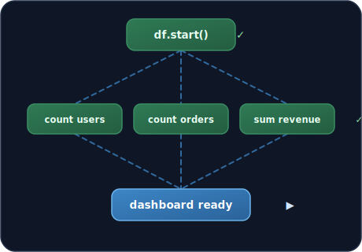

<div align="center">


## Durable SQL functions for PostgreSQL — no extra infra.

Long-running, fault-tolerant functions defined entirely in SQL. Composable operators,
automatic checkpointing, crash-safe replay, and parallel execution. Built on Postgres —
no external orchestrators, no YAML, no separate deployment.

[Website](https://microsoft.github.io/pg_durable/) · [Docs](docs/) · [Quick Example](#quick-example) · [GitHub](https://github.com/microsoft/pg_durable)

[](LICENSE.txt)
[](https://www.postgresql.org/)

<br />



</div>

## Features

- **Durable** — Function state persists to PostgreSQL. Survives crashes, restarts, and failovers.
- **SQL-native** — Define functions in SQL using composable operators.
- **Database-aware** — First-class primitives for scheduling, conditions, and parallel execution.
- **Zero infrastructure** — Runs as a PostgreSQL extension. No Redis, no Temporal, no external services.

## Quick Example

```sql
-- A durable function that processes data in steps
SELECT df.start(
    'SELECT id FROM documents WHERE processed = false LIMIT 100' |=> 'batch'
    ~> 'UPDATE documents SET processed = true WHERE id = ANY($batch)'
);
```

## How It Works

1. **Define functions in SQL** using composable operators like `~>` (sequence) and `|=>` (name result)
2. **Start functions** with `df.start()` which returns an instance ID
3. **Runtime executes durably** — each step is checkpointed, survives crashes via replay
4. **Query progress** anytime from standard PostgreSQL tables

## Prerequisites

- PostgreSQL 17
- Rust (nightly)
- [cargo-pgrx](https://github.com/pgcentralfoundation/pgrx) 0.16.1

## Packages

Tagged releases publish Debian packages for PostgreSQL 17 and 18 on amd64 from the GitHub release assets. Packages are named `pg-durable-postgresql-<PG major>_<pg_durable version>-1_<arch>.deb` and install the extension library, control file, and SQL upgrade files into the matching PostgreSQL installation directories.

After installing a package, add `pg_durable` to `shared_preload_libraries`, restart PostgreSQL, and create the extension in the configured pg_durable database:

```sql
CREATE EXTENSION pg_durable;
```

The default pg_durable database is `postgres`; see [User Guide](USER_GUIDE.md) for background worker configuration and privilege setup.

Release assets also include source archives for building from source.

## Development Installation

### GitHub Codespace

The main branch prebuild installs PostgreSQL 17, builds `pg_durable`, and prepares a local cluster under `~/.pgrx` with the extension ready. PostgreSQL is not left running, so start it when you begin working.

```bash
# Start PostgreSQL
./scripts/pg-start.sh

# Connect
~/.pgrx/17.*/pgrx-install/bin/psql -h localhost -p 28817 -d postgres
```

On a branch without a ready prebuild, run `pg-start.sh` — it will build and install the extension on first run (expect a few minutes):

```bash
./scripts/pg-start.sh
```

### Other environments

#### Local and Dev Container

A VS Code Dev Container (`.devcontainer/`) provides Rust, cargo-pgrx, and PostgreSQL 17 pre-installed. For a bare local machine, install the toolchain first by following the steps in `.devcontainer/onCreateCommand.sh`.

```bash
# Build, initialize PostgreSQL, and install the extension
# This takes a while - go do something else
./scripts/pg-start.sh

# Connect to the local pgrx PostgreSQL instance
~/.pgrx/17.*/pgrx-install/bin/psql -h localhost -p 28817 -d postgres
```

`pg-start.sh` bootstraps new local data directories with a `postgres` superuser and also creates a matching superuser role for the current OS user, so default local `psql` usage continues to work. Use `-U postgres` if you want to force the canonical bootstrap role explicitly.

#### Docker

```bash
# Build and test
./scripts/test-e2e-docker.sh --rebuild

# Optional: Deploy to ACR (for custom PG17 image with pg_durable baked-in)
./scripts/deploy-acr.sh
```

## Multi-User Setup

`CREATE EXTENSION pg_durable` does **not** grant any privileges to `PUBLIC`. After installing the extension, the admin must explicitly grant access to application roles. Row-level security (RLS) ensures each user can only see and manage their own durable function instances and nodes.

**Grant privileges to an application role:**

```sql
-- Grant to specific roles after CREATE EXTENSION
SELECT df.grant_usage('app_role');
```

Alternatively, create an indirection role and grant membership to application roles:

```sql
-- Create a shared role for pg_durable access
CREATE ROLE pg_durable_user NOLOGIN;
SELECT df.grant_usage('pg_durable_user');

-- Grant membership to application roles
GRANT pg_durable_user TO app_backend, etl_service;
```

> See the [User Guide — Privilege Grants](USER_GUIDE.md#privilege-grants) section for the full list of individual grants, revoking access, and hardening upgraded installs.

> **Note:** `GRANT EXECUTE ON ALL FUNCTIONS` only applies to functions that exist when the grant runs. After upgrading pg_durable with `ALTER EXTENSION pg_durable UPDATE`, re-run `df.grant_usage('role')` (or re-issue the manual grants) so new functions are accessible.

**Key points:**
- The background worker role (`pg_durable.worker_role` GUC, default: `azuresu`) **must be a superuser** — it bypasses RLS to manage all users' instances
- Users get `SELECT` + `INSERT` on `df.instances` / `df.nodes`, column-level `UPDATE (status, updated_at)` on instances for `df.cancel()`
- Identity column (`submitted_by`) cannot be modified by users
- **`df.vars` uses per-user scoping** — each user has their own variable namespace via an `owner` column and RLS. Superusers bypass RLS but DSL functions still scope to the calling user via explicit filters. Avoid storing secrets in plain text

## Continuous Integration

All pull requests must pass the following checks before merging:

1. **Format Check** — `cargo fmt --check`
2. **Clippy & Tests** — `cargo clippy`, unit tests (`cargo pgrx test pg17`), pg_regress tests, and E2E tests

The CI workflow is defined in [.github/workflows/ci.yml](.github/workflows/ci.yml). It uses pgrx to download and manage PostgreSQL.

## Testing

pg_durable has two test suites:

### pg_regress Tests (Standard PostgreSQL Regression Tests)

Fast, deterministic tests for core DSL functionality using PostgreSQL's standard testing framework.
Test SQL lives in `sql/`, expected output in `expected/`, and PGXS is configured in the root `Makefile`.

```bash
make test-regress          # full reset + run
make installcheck          # run only (PostgreSQL must already be running)
```

### E2E Tests (Comprehensive Scenario Tests)

Complex local integration tests with pgrx PostgreSQL:

```bash
./scripts/test-e2e-local.sh                                                  # All local SQL E2E tests, including special restart/config phases
./scripts/test-e2e-local.sh 04_parallel                                      # Specific test
./scripts/test-e2e-local.sh --default-build-phases                            # Only the default-build phase group
```

See [tests/e2e/](tests/e2e/) for details.

## Documentation

- [User Guide](USER_GUIDE.md) — Complete usage guide with examples
- [MVP Guide](docs/pg_durable_mvp.md) — Implementation details and internals
- [Examples](examples/README.md) — Example conventions and smoke-check guidance

## Architecture

pg_durable is a PostgreSQL extension (built with [pgrx](https://github.com/pgcentralfoundation/pgrx)) — everything runs inside the PostgreSQL server, no external services. The extension exposes a SQL DSL for building function graphs and registers a background worker that executes them durably on top of two lower-level Rust libraries:

- [duroxide](https://github.com/microsoft/duroxide) — a durable task framework providing the orchestration runtime (deterministic replay, checkpoints, sub-orchestrations, timers).
- [duroxide-pg](https://github.com/microsoft/duroxide-pg) — a PostgreSQL-backed state provider for duroxide. It persists runtime state (instances, history, work queues) in a dedicated `duroxide.*` schema owned by the extension.

```
┌────────────────────────────────────────────────────────────────────┐
│                             PostgreSQL                             │
│                                                                    │
│  ┌──────────────────────────────────────────────────────────────┐  │
│  │                 pg_durable extension (pgrx)                  │  │
│  │                                                              │  │
│  │  SQL DSL     'sql' |=> 'name' ~> 'sql2'                      │  │
│  │              df.if() | df.join() | df.loop()                 │  │
│  │                                                              │  │
│  │  Background worker (hosts the duroxide runtime in-process)   │  │
│  │  ┌────────────────────────────────────────────────────────┐  │  │
│  │  │  duroxide        (orchestration runtime)               │  │  │
│  │  │  ┌──────────────────────────────────────────────────┐  │  │  │
│  │  │  │  duroxide-pg   (PostgreSQL state provider)       │  │  │  │
│  │  │  └──────────────────────────────────────────────────┘  │  │  │
│  │  └────────────────────────────────────────────────────────┘  │  │
│  └──────────────────────────────────────────────────────────────┘  │
│                                                                    │
│  Schemas                                                           │
│    df.*         DSL graphs (nodes, instances, vars)                │
│    duroxide.*   runtime state (owned by duroxide-pg)               │
└────────────────────────────────────────────────────────────────────┘
```

If you'd rather author durable functions in Rust, Python, or Node while still persisting state in PostgreSQL, you can use duroxide and duroxide-pg directly from your host language — pg_durable is what you'd build on top of that pair when you'd prefer authoring in SQL.

## Status

**Preview** - This project is currently in preview.

## Support

Use GitHub Issues for bug reports and feature requests. Do not report security vulnerabilities through public GitHub issues; follow the instructions in [SECURITY.md](SECURITY.md) instead.

## Code of Conduct

This project has adopted the [Microsoft Open Source Code of Conduct](https://opensource.microsoft.com/codeofconduct/). For more information, see the [Code of Conduct FAQ](https://opensource.microsoft.com/codeofconduct/faq/) or contact [opencode@microsoft.com](mailto:opencode@microsoft.com) with questions or comments.

## Security

Microsoft takes the security of our software products and services seriously. Please do not report security vulnerabilities through public GitHub issues. See [SECURITY.md](SECURITY.md) for security reporting instructions.

## Privacy and Telemetry

pg_durable does not send telemetry to Microsoft.

## Trademarks

This project may contain trademarks or logos for projects, products, or services. Authorized use of Microsoft trademarks or logos is subject to and must follow [Microsoft's Trademark & Brand Guidelines](https://www.microsoft.com/en-us/legal/intellectualproperty/trademarks/usage/general). Use of Microsoft trademarks or logos in modified versions of this project must not cause confusion or imply Microsoft sponsorship. Any use of third-party trademarks or logos is subject to those third-party policies.

## License

PostgreSQL License
