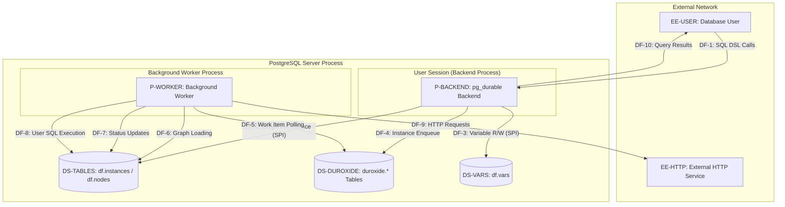
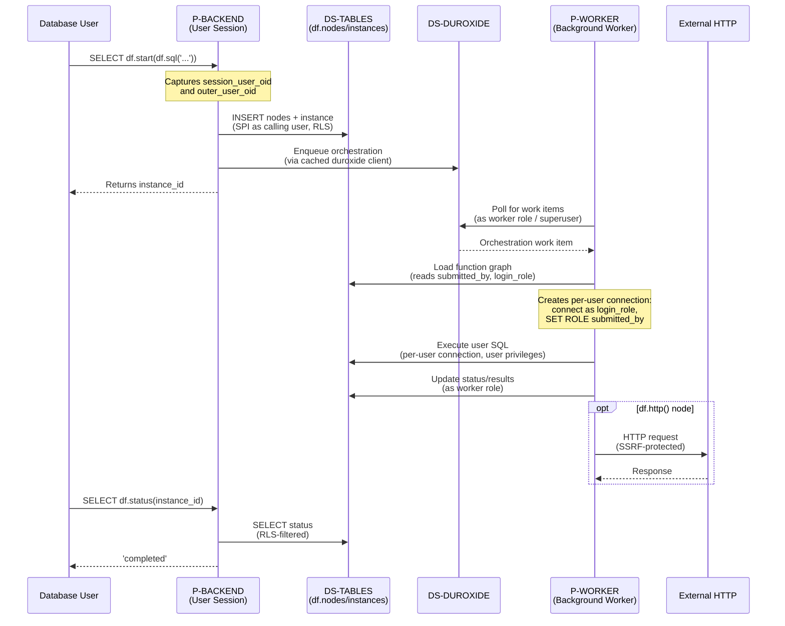
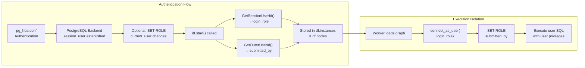
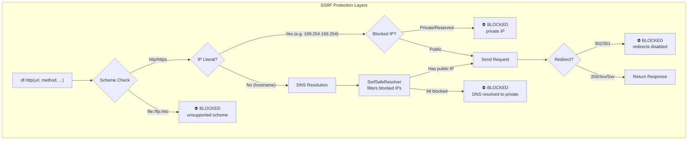

# pg_durable Threat Model — DFD Analysis

**Last Updated**: 2026-03-18  
**Companion Docs**: [security-review.md](security-review.md) | [spec-security-model.md](../spec-security-model.md)  
**TM7 File**: [threat-model.tm7](threat-model.tm7)  
**DFD Source**: [threat-model.dfd-lite.yaml](threat-model.dfd-lite.yaml)  
**Deployment Model**: Single-tenant PostgreSQL instance

---

## 1. DFD Standard Overview

| Element Type | Symbol | Description |
|---|---|---|
| External Entity (EE) | Rectangle | Actor or system outside the trust boundary |
| Process (P) | Circle | Code that transforms or processes data |
| Data Store (DS) | Parallel lines | Persistent data storage |
| Data Flow (DF) | Arrow | Communication between elements |
| Trust Boundary (TB) | Dashed box | Separates areas of different trust levels |

**STRIDE Categories**:

| Category | Affects | Description |
|---|---|---|
| **S**poofing | Process, External | Pretending to be something/someone else |
| **T**ampering | Process, Data Store, Flow | Unauthorized data modification |
| **R**epudiation | Process, Data Store, External | Denying an action occurred |
| **I**nformation Disclosure | Process, Data Store, Flow | Unauthorized data exposure |
| **D**enial of Service | Process, Data Store, Flow | Degrading or denying service availability |
| **E**levation of Privilege | Process | Gaining unauthorized capabilities |

---

## 2. DFD Elements Inventory

### External Entities

| ID | Name | Description | Trust Level |
|---|---|---|---|
| EE-USER | Database User | Application user/DBA connecting via PostgreSQL client. Authenticated via pg_hba.conf. | Semi-trusted (authenticated) |
| EE-HTTP-TARGET | External HTTP Service | External HTTP/HTTPS endpoint called by df.http(). Azure Functions, webhooks, APIs. | Untrusted |

### Processes

| ID | Name | Description | Technology |
|---|---|---|---|
| P-BACKEND | pg_durable Backend (User Session) | Extension code in user's PostgreSQL backend. Executes DSL functions via SPI. Captures user identity at df.start() time. | Rust/pgrx, SPI |
| P-WORKER | pg_durable Background Worker | Persistent BGW running duroxide runtime. Connects as superuser for control-plane; creates per-user connections for SQL execution. | Rust, tokio, sqlx, duroxide |

### Data Stores

| ID | Name | Description | Technology |
|---|---|---|---|
| DS-TABLES | df.instances / df.nodes | Function graph definitions and instance metadata. RLS-protected (submitted_by = current_user::regrole). | PostgreSQL tables |
| DS-DUROXIDE | duroxide.* Tables | Duroxide runtime state (orchestration history, work items, checkpoints). Worker-role access only. | PostgreSQL tables |
| DS-VARS | df.vars | Per-user key-value store. RLS-protected (owner = current_user::regrole). Plaintext values. | PostgreSQL table |

### Trust Boundaries

| ID | Name | Description |
|---|---|---|
| TB-PG | PostgreSQL Server Process | All extension code and data stores run within the PostgreSQL server process |
| TB-USER | User Session (Backend) | Individual user backend processes — each has its own authenticated identity |
| TB-BGW | Background Worker Process | Single persistent worker with elevated (superuser) privileges |
| TB-EXTERNAL | External Network | Users and HTTP targets outside the PostgreSQL server |

---

## 3. Trust Boundary Diagram



### Privilege Isolation Flow



---

## 4. Data Flow Definitions & STRIDE Analysis

### DF-1: SQL DSL Calls

```
EE-USER ──[PostgreSQL wire protocol]──> P-BACKEND
```

| Property | Value |
|---|---|
| Source | EE-USER (Database User) |
| Destination | P-BACKEND (User Session) |
| Data | SQL commands: df.sql(), df.start(), df.status(), df.http(), etc. |
| Classification | User input — arbitrary SQL expressions |
| Encryption | Depends on pg_hba.conf (TLS optional) |
| Trust Boundary Crossed | TB-EXTERNAL → TB-PG → TB-USER |

| STRIDE | Threat | Mitigation | Status |
|---|---|---|---|
| **S** Spoofing | Attacker impersonates legitimate user | PostgreSQL pg_hba.conf authentication (password, cert, GSSAPI) | ✅ Mitigated |
| **T** Tampering | Man-in-middle modifies SQL commands | TLS encryption (if configured in pg_hba.conf); not enforced by default | ⚠️ Partial |
| **R** Repudiation | User denies submitting a durable function | submitted_by and login_role captured at df.start() via GetOuterUserId()/GetSessionUserId() | ✅ Mitigated |
| **I** Information Disclosure | Eavesdropping on wire protocol | TLS encryption (if configured); plaintext by default on localhost | ⚠️ Partial |
| **D** Denial of Service | Flooding with df.start() calls | No rate limiting implemented | ⛔ NOT IMPLEMENTED |
| **E** Elevation of Privilege | User escalates via SECURITY DEFINER | GetOuterUserId() captures *caller* not *definer*; tested in E2E | ✅ Mitigated |

### DF-2: Graph Persistence (SPI)

```
P-BACKEND ──[SPI (in-process)]──> DS-TABLES
```

| Property | Value |
|---|---|
| Source | P-BACKEND (User Session) |
| Destination | DS-TABLES (df.instances / df.nodes) |
| Data | Function graph nodes, instance metadata, user identity (submitted_by, login_role) |
| Classification | Internal control-plane data |
| Encryption | N/A (in-process SPI) |
| Trust Boundary Crossed | TB-USER → TB-PG (same process, different privilege context) |

| STRIDE | Threat | Mitigation | Status |
|---|---|---|---|
| **T** Tampering | User forges submitted_by on inserted rows | RLS WITH CHECK (submitted_by = current_user::regrole); identity set by C API, not user input | ✅ Mitigated |
| **T** Tampering | Direct DML bypasses extension logic | RLS prevents cross-user modifications; column-level UPDATE grants restrict writable columns | ✅ Mitigated |
| **R** Repudiation | User modifies their own instance data | submitted_by is immutable (no UPDATE grant on identity columns) | ✅ Mitigated |
| **I** Information Disclosure | User reads other users' instances | RLS USING (submitted_by = current_user::regrole) | ✅ Mitigated |
| **D** Denial of Service | Mass INSERT of nodes exhausts storage | No per-user quotas on node count | ⛔ NOT IMPLEMENTED |

### DF-3: Variable Read/Write (SPI)

```
P-BACKEND ──[SPI (in-process)]──> DS-VARS
```

| Property | Value |
|---|---|
| Source | P-BACKEND (User Session) |
| Destination | DS-VARS (df.vars) |
| Data | Key-value pairs (name, value, owner) |
| Classification | User configuration data; may contain sensitive values |
| Encryption | N/A (in-process SPI); values stored as plaintext |
| Trust Boundary Crossed | TB-USER → TB-PG |

| STRIDE | Threat | Mitigation | Status |
|---|---|---|---|
| **T** Tampering | User modifies another user's variables | RLS (owner = current_user::regrole) + explicit WHERE filters in DSL functions | ✅ Mitigated |
| **I** Information Disclosure | User reads another user's variables | RLS + explicit WHERE owner = current_user::regrole in getvar/unsetvar/clearvars | ✅ Mitigated |
| **I** Information Disclosure | Superuser reads all users' variables | By design — superuser bypasses RLS; DSL functions use explicit WHERE for consistency | ⚠️ Accepted |
| **I** Information Disclosure | Variables containing secrets stored in plaintext | No encryption at rest for df.vars values | ⚠️ Partial |
| **D** Denial of Service | Mass variable creation exhausts storage | No per-user quota on variable count | ⛔ NOT IMPLEMENTED |

### DF-4: Instance Enqueue

```
P-BACKEND ──[sqlx (TCP localhost)]──> DS-DUROXIDE
```

| Property | Value |
|---|---|
| Source | P-BACKEND (User Session) |
| Destination | DS-DUROXIDE (duroxide.* tables) |
| Data | Orchestration start request (instance_id, orchestration name) |
| Classification | Internal control-plane |
| Encryption | Localhost TCP (trust auth, no TLS) |
| Trust Boundary Crossed | TB-USER → TB-PG (via cached Duroxide client) |

| STRIDE | Threat | Mitigation | Status |
|---|---|---|---|
| **S** Spoofing | Attacker directly inserts into duroxide.* tables | No GRANT to PUBLIC on duroxide schema; users lack direct access | ✅ Mitigated |
| **T** Tampering | Corrupted enqueue data causes worker malfunction | Duroxide client API validates inputs; instance_id is UUID-generated | ✅ Mitigated |
| **D** Denial of Service | Mass enqueue floods worker queue | No rate limiting on df.start() calls | ⛔ NOT IMPLEMENTED |

### DF-5: Work Item Polling

```
P-WORKER ──[sqlx pool (TCP localhost)]──> DS-DUROXIDE
```

| Property | Value |
|---|---|
| Source | P-WORKER (Background Worker) |
| Destination | DS-DUROXIDE (duroxide.* tables) |
| Data | Orchestration/activity work items |
| Classification | Internal runtime state |
| Encryption | Localhost TCP (trust auth) |
| Trust Boundary Crossed | TB-BGW → TB-PG (both within PostgreSQL server) |

| STRIDE | Threat | Mitigation | Status |
|---|---|---|---|
| **T** Tampering | Poisoned work items cause code execution | Worker reads from duroxide tables it owns; data provenance is trusted | ✅ Mitigated |
| **I** Information Disclosure | Worker role exposes all duroxide state | Worker role is superuser — acceptable for single-tenant; duroxide schema not granted to users | ✅ Mitigated |
| **D** Denial of Service | Large backlog starves worker connections | Fixed worker connection pool limits concurrent database work | ⚠️ Partial |

### DF-6: Graph Loading

```
P-WORKER ──[sqlx (TCP localhost)]──> DS-TABLES
```

| Property | Value |
|---|---|
| Source | P-WORKER (Background Worker) |
| Destination | DS-TABLES (df.instances / df.nodes) |
| Data | Function graph nodes including submitted_by, login_role, queries |
| Classification | User-authored SQL + identity metadata |
| Encryption | Localhost TCP (trust auth) |
| Trust Boundary Crossed | TB-BGW → TB-PG |

| STRIDE | Threat | Mitigation | Status |
|---|---|---|---|
| **T** Tampering | Attacker modifies node queries between insert and execution | RLS restricts UPDATE; no UPDATE grant on query column for users; timing window is small | ✅ Mitigated |
| **T** Tampering | Attacker modifies submitted_by to escalate privileges | No UPDATE grant on submitted_by column; RLS prevents cross-user writes | ✅ Mitigated |
| **I** Information Disclosure | Worker reads and logs user SQL queries | Worker logs query text in trace_info; appropriate for debugging; logs should be protected | ⚠️ Partial |

### DF-7: Status Updates

```
P-WORKER ──[sqlx (TCP localhost)]──> DS-TABLES
```

| Property | Value |
|---|---|
| Source | P-WORKER (Background Worker) |
| Destination | DS-TABLES (df.instances / df.nodes) |
| Data | Status transitions (pending→running→completed/failed), result JSON |
| Classification | Internal state management |
| Encryption | Localhost TCP (trust auth) |
| Trust Boundary Crossed | TB-BGW → TB-PG |

| STRIDE | Threat | Mitigation | Status |
|---|---|---|---|
| **T** Tampering | Worker uses string formatting for status update SQL | instance_id and node_id originate from trusted duroxide orchestration, not user input; low risk but could be parameterized | ⚠️ Partial |
| **I** Information Disclosure | Execution results may contain sensitive data | Results stored in df.nodes (RLS-protected); visible only to submitting user | ✅ Mitigated |

### DF-8: User SQL Execution

```
P-WORKER ──[sqlx per-user connection (TCP localhost)]──> DS-TABLES
```

| Property | Value |
|---|---|
| Source | P-WORKER (Background Worker) |
| Destination | DS-TABLES (user's own tables, any accessible schema) |
| Data | User-authored SQL queries; query results as JSON |
| Classification | **User-controlled SQL** — highest-risk data flow |
| Encryption | Localhost TCP (trust auth, per-user connection) |
| Trust Boundary Crossed | TB-BGW → TB-PG (with privilege downgrade to user identity) |

| STRIDE | Threat | Mitigation | Status |
|---|---|---|---|
| **S** Spoofing | Worker impersonates wrong user | login_role and submitted_by captured via C API (GetSessionUserId, GetOuterUserId); cannot be spoofed | ✅ Mitigated |
| **T** Tampering | User SQL modifies data beyond their privileges | Connection authenticated as login_role + SET ROLE submitted_by; standard PostgreSQL RBAC applies | ✅ Mitigated |
| **E** Elevation via RESET ROLE | User SQL contains `RESET ROLE` to escape to worker | RESET ROLE reverts to login_role (user's own identity), not worker role; connection is separate | ✅ Mitigated |
| **E** Elevation via SET ROLE | User attempts `SET ROLE postgres` | SET ROLE requires role membership (checked against login_role); standard PostgreSQL RBAC | ✅ Mitigated |
| **E** Elevation via dynamic SQL | User obfuscates privilege escalation | Dynamic SQL runs on same per-user connection; authenticated identity is immutable | ✅ Mitigated |
| **T** Tampering | Variable substitution ({var}) injects SQL | By design: vars are SQL fragments substituted as-is; user controls both var content and query; runs with user's own privileges | ⚠️ Accepted |
| **I** Information Disclosure | Result substitution ($name) leaks cross-user data | Results are per-instance; RLS prevents cross-user access to nodes/instances | ✅ Mitigated |
| **D** Denial of Service | Long-running queries block worker connections | Per-user connections are not pooled (created per execution); worker pool not consumed | ✅ Mitigated |

### DF-9: External HTTP Requests

```
P-WORKER ──[HTTP/HTTPS (external network)]──> EE-HTTP-TARGET
```

| Property | Value |
|---|---|
| Source | P-WORKER (Background Worker) |
| Destination | EE-HTTP-TARGET (External HTTP Service) |
| Data | HTTP requests with user-specified URL, method, body, headers |
| Classification | **External network I/O** — SSRF-critical data flow |
| Encryption | HTTPS if user specifies; HTTP also allowed |
| Trust Boundary Crossed | TB-PG → TB-EXTERNAL |

| STRIDE | Threat | Mitigation | Status |
|---|---|---|---|
| **S** Spoofing | Attacker redirects HTTP to malicious endpoint | Redirects disabled in reqwest client (Policy::none()) | ✅ Mitigated |
| **T** Tampering | Man-in-middle modifies HTTP response | HTTPS available; HTTP also allowed (user's choice) | ⚠️ Partial |
| **T** Tampering (SSRF) | User targets internal network (169.254.169.254, 10.x, 127.x) | Compile-time IP blocklist; scheme validation; IP literal check; SsrfSafeResolver; DNS rebinding protection | ✅ Mitigated |
| **T** Tampering (SSRF) | IPv4-mapped IPv6 bypass (::ffff:169.254.169.254) | IPv4-mapped IPv6 extraction before blocklist check | ✅ Mitigated |
| **R** Repudiation | User denies making HTTP request | Audit logging: submitted_by, login_role, URL, method in trace_info | ✅ Mitigated |
| **I** Information Disclosure | Data exfiltration via HTTP POST to attacker endpoint | REVOKE EXECUTE on df.http() not yet default; no URL allowlist | ⛔ NOT IMPLEMENTED |
| **I** Information Disclosure | Credentials in headers stored in df.nodes | HTTP config (including headers with auth tokens) stored in node query column; RLS-protected | ⚠️ Partial |
| **D** Denial of Service | Attacker creates many HTTP requests to exhaust outbound connections | No rate limiting; timeout configurable (default 30s) | ⛔ NOT IMPLEMENTED |

### DF-10: Query Results to User

```
P-BACKEND ──[PostgreSQL wire protocol]──> EE-USER
```

| Property | Value |
|---|---|
| Source | P-BACKEND (User Session) |
| Destination | EE-USER (Database User) |
| Data | Instance IDs, status strings, result JSON |
| Classification | User's own workflow results |
| Encryption | Depends on pg_hba.conf TLS configuration |
| Trust Boundary Crossed | TB-PG → TB-EXTERNAL |

| STRIDE | Threat | Mitigation | Status |
|---|---|---|---|
| **I** Information Disclosure | User receives other users' results | RLS on df.instances and df.nodes; parameterized SPI in df.status() and df.result() | ✅ Mitigated |
| **I** Information Disclosure | Results contain sensitive data from executed queries | User authored the query; results are their own data | ✅ Accepted |
| **T** Tampering | Eavesdropping on result data | TLS optional (not enforced by extension) | ⚠️ Partial |

---

## 5. Threat Summary by Priority

### ⛔ Critical / P0 — Address Before Production

| ID | Flow | Threat | STRIDE | Status |
|---|---|---|---|---|
| T-DoS-1 | DF-1, DF-4 | No rate limiting on df.start() — unbounded instance creation | D | ⛔ NOT IMPLEMENTED |
| T-Exfil-1 | DF-9 | df.http() data exfiltration — no URL allowlist or REVOKE EXECUTE by default | I | ⛔ NOT IMPLEMENTED |

### 🟠 High / P1 — Fix Before Preview

| ID | Flow | Threat | STRIDE | Status |
|---|---|---|---|---|
| T-DoS-2 | DF-9 | No rate limiting on HTTP requests — outbound connection exhaustion | D | ⛔ NOT IMPLEMENTED |
| T-DoS-3 | DF-2 | No per-user quota on node/instance creation — storage exhaustion | D | ⛔ NOT IMPLEMENTED |
| T-Secrets-1 | DF-3 | df.vars stores values as plaintext — no encryption at rest | I | ⚠️ Accepted risk |
| T-Creds-1 | DF-9 | HTTP auth headers stored unencrypted in df.nodes query column | I | ⚠️ Partial |

### ⚠️ Medium / P2 — Fix Before GA

| ID | Flow | Threat | STRIDE | Status |
|---|---|---|---|---|
| T-TLS-1 | DF-1, DF-10 | PostgreSQL wire protocol not encrypted by default | I, T | ⚠️ Partial |
| T-SQL-1 | DF-7 | Status update activities use string formatting (not parameterized) | T | ⚠️ Partial |
| T-Log-1 | DF-6 | Worker logs user SQL queries in trace_info | I | ⚠️ Partial |
| T-Var-1 | DF-8 | Variable substitution ({var}) is raw SQL injection by design | T | ⚠️ Accepted |
| T-HTTP-1 | DF-9 | HTTP (non-TLS) allowed for outbound requests | I, T | ⚠️ Partial |

### ℹ️ Low / Informational

| ID | Flow | Threat | STRIDE | Status |
|---|---|---|---|---|
| T-RLS-1 | DF-2 | RLS not FORCE-enabled — superuser/table-owner bypass | I | ✅ Accepted (by design) |
| T-SU-1 | DF-3 | Superuser sees all variables via direct table queries | I | ✅ Accepted (by design) |
| T-SECDEF-1 | DF-1 | SECURITY DEFINER captures definer privileges if df.start() called inside | E | ✅ Documented |

---

## 6. Authentication & Authorization Flow



---

## 7. SSRF Protection Architecture



---

## 8. References

- [Microsoft Threat Modeling Tool](https://aka.ms/threatmodelingtool)
- [STRIDE Methodology](https://docs.microsoft.com/en-us/azure/security/develop/threat-modeling-tool-threats)
- [OWASP Threat Dragon](https://owasp.org/www-project-threat-dragon/)
- [pg_durable Security Model Spec](../spec-security-model.md)
- [pg_durable HTTP Security](../http-security.md)
- [pg_durable User Isolation Design](../user-isolation.md)
- [pg_durable RLS Design](../rls.md)
