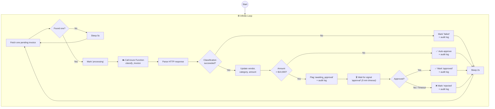

# Invoice Approval Pipeline — pg_durable Demo

An always-on invoice processing pipeline that classifies invoices via an Azure Function, auto-approves small ones, and pauses for human approval on high-value invoices — all orchestrated from SQL inside PostgreSQL.

## What This Shows

| pg_durable Feature | How It Appears |
|---|---|
| **Infinite Loop** (`@>`) | Pipeline polls for new invoices continuously |
| **HTTP / Azure Functions** (`df.http()`) | Calls a deployed Azure Function to classify each invoice |
| **Human-in-the-Loop** (`df.wait_for_signal`) | High-value invoices (> $10K) pause until a human approves |
| **Conditional Branching** (`df.if`) | Routes invoices through auto-approve or approval-required paths |
| **Named Results** (`\|=>`) | Passes data between steps (invoice → request body → HTTP response → decision) |
| **Visualization** (`df.explain`) | Shows both the static graph and live execution status |
| **Monitoring** (`df.list_instances`, `df.status`) | Observe the pipeline in real time |

## Scenario (Plain English)

> Invoices arrive in a PostgreSQL table. A background pipeline picks each one up, sends it to an Azure Function that reads the amount and categorizes it (supplies, consulting, hardware, etc.). Small invoices are approved automatically. Large invoices (over $10,000) are flagged and the pipeline **waits** for a human to approve or reject them. New invoices can arrive at any time — the loop picks them up on its next pass.

## Pipeline Flowchart



## Request / Response Shape

**Request** (sent to Azure Function):
```json
{
  "invoice_id": 2,
  "description": "GlobalTech Consulting - Cloud infrastructure advisory",
  "raw_amount": "$24,500.00"
}
```

**Response** (from Azure Function):
```json
{
  "invoice_id": 2,
  "vendor": "GlobalTech Consulting",
  "category": "consulting",
  "amount": 24500.00,
  "currency": "USD",
  "requires_approval": true,
  "confidence": 0.92
}
```

## Directory Layout

```
examples/invoice-approval/
├── README.md                 ← you are here
├── function-app/
│   ├── host.json
│   ├── requirements.txt
│   └── classify_invoice/
│       ├── __init__.py       ← deterministic classifier (no AI dependency)
│       └── function.json
├── scripts/
│   ├── create_function_app.sh
│   ├── deploy_function.sh
│   ├── configure_pg.sh
│   ├── cleanup_azure.sh
│   ├── feed_invoices.sh      ← insert random invoices mid-demo
│   └── smoke_check.sh
└── sql/
    ├── 01_schema.sql         ← tables + truncate
    ├── 02_set_vars.sql       ← df.setvar for URL/key
    ├── 03_seed_data.sql      ← 2 invoices (1 small, 1 large)
    ├── 04_explain.sql        ← dry-run: preview the graph
    ├── 05_start_workflow.sql  ← launch the pipeline
    ├── 06_monitor.sql        ← check invoice status + audit trail
    ├── 07_approve.sql        ← send approval signal
    ├── 08_explain_live.sql   ← live graph with ✓/⏳ markers
    ├── 09_verify.sql         ← final state summary
    └── 10_cancel.sql         ← stop the pipeline
```

## Prerequisites

- Azure CLI (`az`) installed and logged in (`az login`)
- Azure Functions Core Tools (`func`)
- PostgreSQL with pg_durable enabled
- `psql` available (system or pgrx)

## Setup

### 1) Provision Azure Function App

```bash
cd examples/invoice-approval
chmod +x scripts/*.sh

./scripts/create_function_app.sh -l eastus
```

### 2) Deploy the classifier function

```bash
./scripts/deploy_function.sh
```

### 3) Smoke-check the function

```bash
./scripts/smoke_check.sh
```

### 4) Create demo schema

```bash
psql -d postgres -p 28817 -f sql/01_schema.sql
```

### 5) Configure pg_durable variables

```bash
./scripts/configure_pg.sh -d postgres -p 28817
```

### 6) Insert seed data

```bash
psql -d postgres -p 28817 -f sql/03_seed_data.sql
```

## 10-Minute Demo Script

### Minute 0–1: The Problem

> "Invoices come in. Small ones can be auto-approved, but anything over $10K needs a human to sign off. We want this to run continuously inside PostgreSQL — no external job queue, no microservices."

### Minute 1–2:30: Show the SQL

Open [sql/05_start_workflow.sql](sql/05_start_workflow.sql) and walk through the structure:
- The infinite loop (`@>`)
- The Azure Function call (`df.http`)
- The branching (`df.if` on amount threshold)
- The signal wait (`df.wait_for_signal`)

### Minute 2:30–3:30: Visualize the Graph

```bash
psql -d postgres -p 28817 -f sql/04_explain.sql
```

This shows the `df.explain()` dry-run — the tree structure of the pipeline without executing it. Also show the Mermaid diagram above.

### Minute 3:30–4:30: Start the Pipeline

```bash
psql -d postgres -p 28817 -f sql/05_start_workflow.sql
```

Note the instance ID returned. The pipeline immediately starts processing the 2 seeded invoices.

### Minute 4:30–5:30: Watch It Work

```bash
psql -d postgres -p 28817 -f sql/06_monitor.sql
```

You should see:
- Invoice #1 ($3,420 — office supplies): **auto-approved** ✅
- Invoice #2 ($24,500 — consulting): **awaiting_approval** ⏳

### Minute 5:30–6:00: Show the Live Graph

```sql
SELECT df.explain('<instance-id>');
```

The signal wait node shows ⏳. 

### Minute 6:00–6:30: Human Approves

```sql
SELECT df.signal('<instance-id>', 'approval', '{"approved": true, "approver": "demo-user"}');
```

### Minute 6:30–7:00: Confirm Approval

```bash
psql -d postgres -p 28817 -f sql/06_monitor.sql
```

Invoice #2 is now **approved**, audit trail shows the approver.

### Minute 7:00–8:00: Feed More Invoices

In another terminal:

```bash
./scripts/feed_invoices.sh -d postgres -p 28817 -n 3
```

Wait a few seconds, then monitor again — the loop picks them up automatically.

### Minute 8:00–9:00: Show the Pipeline Keeps Going

```bash
psql -d postgres -p 28817 -f sql/06_monitor.sql
```

New invoices are being processed. Any over $10K will pause for signals.

### Minute 9:00–9:30: Final State

```bash
psql -d postgres -p 28817 -f sql/09_verify.sql
```

### Minute 9:30–10:00: Wrap Up

> "This entire pipeline — HTTP calls, human approval gates, infinite loops, conditional logic — runs inside PostgreSQL. No external orchestrator. Survives crashes. All visible through SQL."

Optionally cancel the pipeline:

```sql
SELECT df.cancel('<instance-id>', 'Demo complete');
```

## Cleanup

```bash
./scripts/cleanup_azure.sh -y
```

## Operational Notes

- The classifier Azure Function is deterministic (keyword-based, no AI). It always returns consistent results for the same input.
- The $10,000 threshold is hardcoded in the SQL workflow — change it in `05_start_workflow.sql` to adjust.
- The approval signal has a 5-minute timeout. If no signal is sent, the invoice is automatically rejected.
- `feed_invoices.sh -s 10` runs continuously, inserting a batch every 10 seconds.
